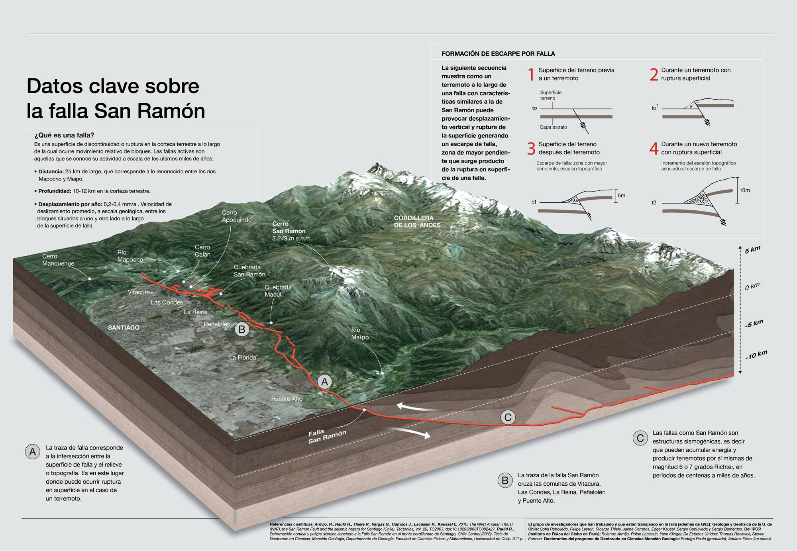
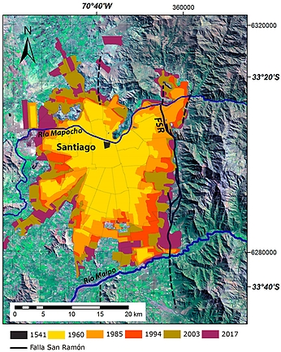
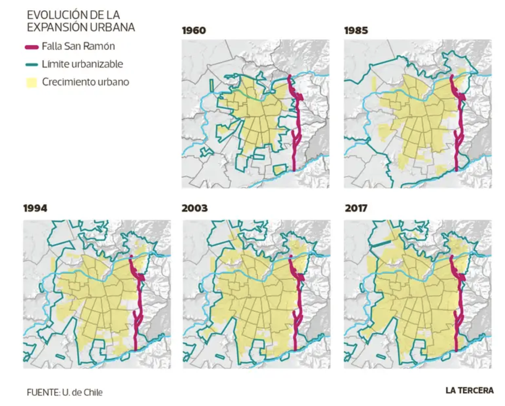
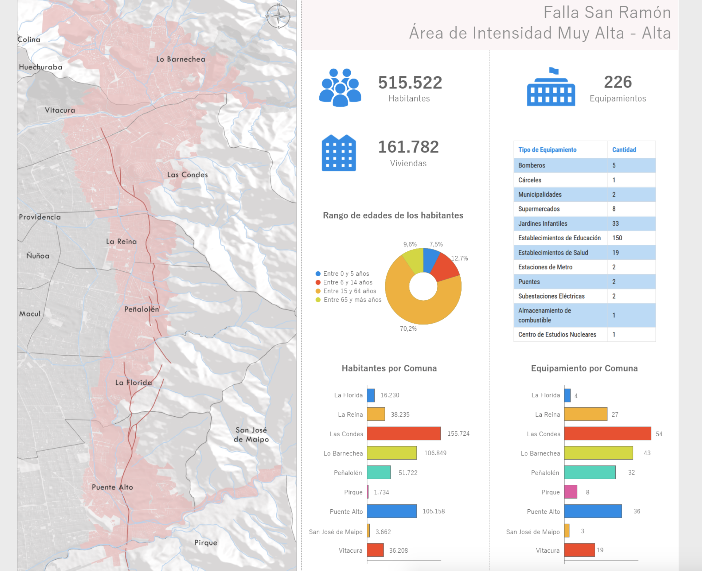
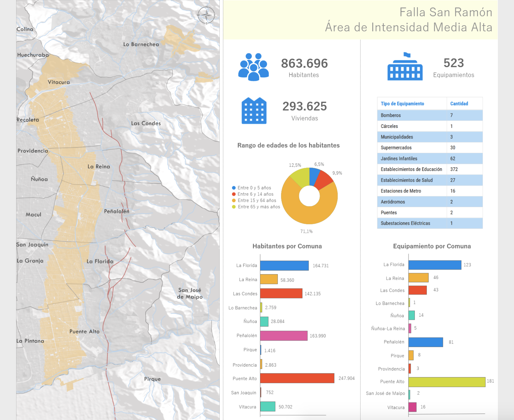
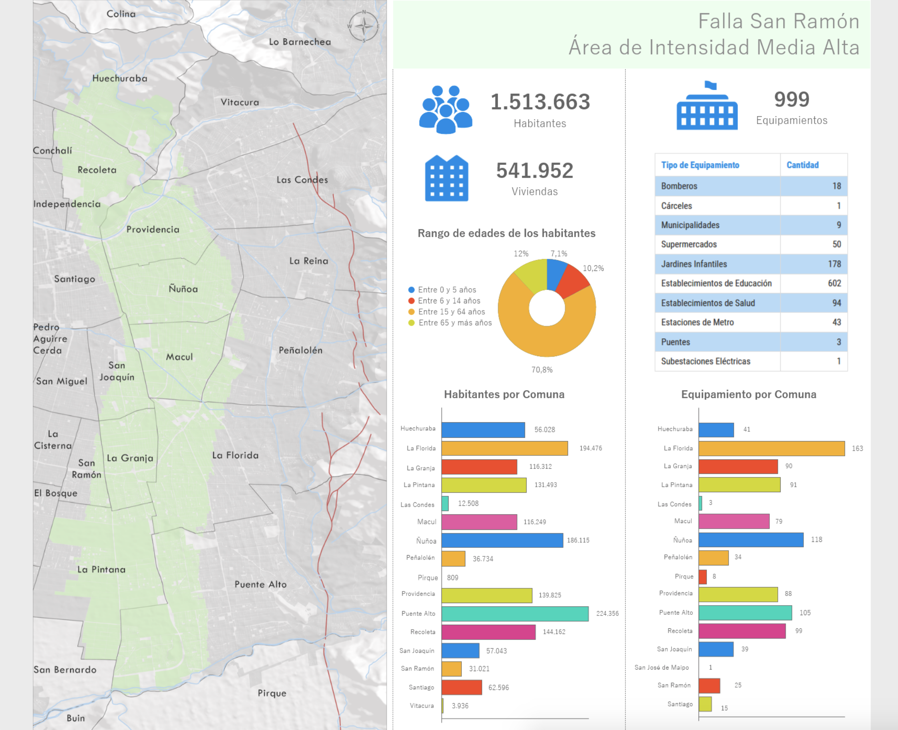

# Linea Narrativa

-Quién lo va a leer: Personas que viven en Santiago.

-Qué quieren los lectores: Informarse de la Falla de San Ramón para estar conscientes de posibles catástrofes. 

-Que queremos nosotras: Informarlos y hacer consciencia sobre los riesgos de la falla.

Puntos principales
## → ¿Qué es una falla?
>"Una falla geológica es una discontinuidad entre macizos de rocas en la cual ha ocurrido un desplazamiento relativo entre 2 o mas bloques."

Existen tres tipos de fallas:

-Normal: Fallas con un plano inclinado donde el bloque colgante se desplaza hacia abajo con respecto al bloque yacente.

-Inversa: Fallas en las que el bloque colgante se desplaza hacia arriba con respecto al bloque yacente.

-Rumbo: Se denominan fallas de rumbo a las fallas con desplazamientos horizontales y paralelos a la línea de falla. Según el sentido de movimiento existen dos tipos de falla de rumbo. (1) Dextral: Fallas de rumbo en las que el bloque que está a la derecha del plano de falla (desde el punto de vista del observador) se desplaza hacia este. (2) Sinestral: Fallas de rumbo en las que el bloque que está a la derecha del observador (tomando referencia el plano de falla) se aleja de este.

#### Referencias
- https://fallasdechile.sitios.ing.uc.cl/que-es-una-falla/

## → ¿Qué es la falla de San Ramón? 
-(qué tipo, dónde está + mapa, longitud, profundidad, áreas de riesgo, zonas involucradas, principales características etc etc…)

Información: La Falla de Ramón es una falla geológica activa del tipo inversa que se encuentra situada al oriente de Santiago, la capital de Chile, siguiendo el pie de cerro de la sierra de Ramón a la que debe su nombre.

Esta se ubica a 5 km bajo la superficie terrestre y tiene una extensión de 25 km en sentido norte-sur. Se ubica entre los ríos Mapocho y Maipo, bordeando todo el frente cordillerano de la ciudad de Santiago, cruzando las comunas de Vitacura, Las Condes, La Reina, Peñalolén, La Florida y Puente Alto, aunque se piensa que podría prolongarse a Lo Barnechea y Pirque. Se puede identificar como un súbito escalón que se alza sobre el valle de Santiago se ubica entre la placa de Nazca y la placa Sudamericana.

La falla de Ramón es una falla inversa (Bloque superior e inferior, siendo el superior el más propenso a daños), vale decir con deslizamiento vertical, que ha sido la responsable de la formación de la sierra de Ramón, una cordillera de 25 kilómetros de largo y una altitud máxima de 3249 msnm, la cual se ha desplazado bastante en los últimos 10 millones de años. Ha tenido un crecimiento continuo y progresivo durante el periodo cuaternario reciente, lo que la convierte en una falla geológicamente activa con trazas de deformación del orden de 0,02 mm/año, que la hacen capaz de producir sismos de gran magnitud, como el terremoto del 17 de marzo de 1575, o el de mayo de 1647.

La falla representa una franja de discontinuidad en el sustrato rocoso que modifica sus características al producirse una fragmentación de la roca, generando brecha de falla, dislocamiento y fracturamiento de bloques en el entorno inmediato a ella, e incluso registrando manifestaciones hidrotermales que conducen a la alteración química de la roca.

## → Posible catástrofe: 
-Magnitudes, ruptura, cambios geográficos, desniveles, cuando ocurre, predicciones, ciclos y monitoreo

Info: La Falla San Ramón representa dos fuentes de amenaza directa para la Región Metropolitana: por una parte, la posibilidad de propagación de la ruptura en superficie y por otra, la posibilidad de aceleraciones o movimientos del suelo mucho mayores a los registrados durante el terremoto del Maule en 2010 en Santiago. A lo anterior, se suma la potencial ocurrencia de remociones en masa asociadas a un terremoto de gran magnitud.

En efecto, las evidencias paleosismológicas muestran que la Falla San Ramón es capaz de acumular esfuerzos tectónicos y producir —por sí misma— grandes terremotos, con dos episodios de gran magnitud (MW7,2-7,5) ocurridos en los últimos 17.000 años, y el último hace unos 8.000 años atrás. De acuerdo con estos mismos antecedentes, en cada uno de estos terremotos la propagación de la ruptura en superficie a lo largo de la falla movió del orden de 5 m el bloque oriental de la corteza terrestre respecto del occidental, levantando de 2 a 3 m el bloque cordillerano por sobre el valle de Santiago.

Frente a este posible riesgo, en el gobierno de Michelle Bachelet (2017) se inaguran centros de monitoreo de la falla de San Ramón, esto con la utilidad de saber la actividad de la falla para complementar la evidencia geológica. Esto permitirá crear medidas de prevención con mayor detalle empírico científico. Esta red permite ver eventos sísmicos pequeños que suman a la investigación general del evento. Si bien este monitoreo a permitido acumular datos sísmicos, aún se necesita más información para poder determinar en que etapa del ciclo de la falla nos encontramos y con esto, poder predicir futuras catástrofes.

## → Urbanización: 
Historia de cómo se ha construido alrededor de la falla (scroll down: Cómo la urbanización aumenta según el pasar de los años, edificios, casas, establecimientos, etc)

Información: la falla Santiago ha experimentado en sus últimas décadas un aumento considerable de áreas urbanizadas en el piedemonte de su borde oriente, donde además se localiza la Falla San Ramón (FSR), de modo que se ha vuelto un nuevo escenario de riesgo geológico. Usando incuestionables atractivos sobre el medio natural, la vista panorámica a la ciudad y un ambiente saludable, se han promocionado proyectos de vivienda de alto costo que conviven con este riesgo sísmico, pero que parecen desestimarlo desde los instrumentos de planificación de nivel comunal y metropolitano.

Hasta 1960 la urbanización sobre la falla era prácticamente nula, pues la edificación se concentraba sobre el valle central, aún cuando el Plan Regulador Intercomunal de Santiago (PRIS) autorizaba la construcción en un 30% sobre la falla, en el sector nororiente de la capital. En 1979, casi 20 años después, se comenzaron a introducir una serie de cambios que fueron modificando los límites urbanos de la RM. Lo anterior fue agudizado con la presencia de asentamientos irregulares que comenzaron a desarrollarse en el borde de la franja suburbana durante las tres décadas siguientes. Con el paso de los años, poco a poco la edificación sobre la falla fue aumentando.Y la tendencia no se detuvo. Si a comienzos de los 60 el porcentaje era casi nulo, para 1985 la cifra se elevó a un 22%. En 1994 entró en vigencia el Plan Regulador Metropolitano de Santiago (PRMS), el que incluyó aspectos normativos en materia de riesgos. No obstante, la realidad territorial no experimentó un panorama distinto respecto al crecimiento de la zona urbana sobre la FSR, en particular, y cada vez más sobre el piedemonte andino. De esta forma, la urbanización en comunas como Lo Barnechea, Vitacura, Las Condes, Puente Alto, en el sector de Las Vizcachas, y Peñalolén aumentó considerablemente sobre la falla, sin esto ir de la mano con cambios normativos. Actualmente existe un 55% de urbanización sobre la Falla de San Ramón, incrementando “el riesgo al cual están expuestos sus habitantes”. Un estudio indicó que más de 3 millones de personas serían afectadas ante un sismo en la Falla de San Ramón, siendo Puente Alto la comuna más dañada con un 61,8% de su población, le seguirían Las Condes con 55,4%, Peñalolén (39,6%) y La Florida (34,6%). Incluso podría ser mayor al ocurrido el 27 de febrero de 2010.

Sonia Pérez, académica de la Facultad de Ciencias Sociales y actual vierrectora de Asuntos Estudiantiles y Comunitarios, explica que sin información, las personas tienen menos posibilidad de enfrentar el riesgo. “La planificación urbana debiera entregar esa información para que las personas puedan tomar decisiones autónomas respecto de dónde y cómo quieren vivir. En la zona hay que convivir con el riesgo y eso implica tener estrategias comunitarias para hacer frente a los problemas que ocasionaría un terremoto. Estrategias que no pueden ser planificadas si no se informan dónde y cómo estamos expuestos a la amenaza”. Por esto mismo, el sector se transforma en un elemento de riesgo real y por esto es necesario tener conciencia de la falla y tomar medidas, como por ejemplo, reconocer la existencia de la falla en los planos normativos y generar zonas de resguardo y restricciones. Además, se debe restringir la construcción sobre la traza de la falla que aún no se ha edificado. Un sismo en este tipo de fallas, puede generar desplazamientos de bloques en la componente vertical que pueden alcanzar los dos o tres metros.

 
## → Actualidad y zonas de riesgo
Mapa actual / áreas de peligro hover y clicks (Cuánta gente vive, que edificaciones hay, hectáreas, etc)
  

Info: Los estudios realizados con simulaciones para un sismo de magnitud 7.4Mw han identificado áreas las cuales tendrían distintos niveles de intensidad de movimiento y que irían entre Muy Alta-Alta, Media Alta y Media. Estas categorías están dadas por las aceleraciones del suelo que produciría dicho sismo y han sido establecidas de acuerdo a ciertas distancias según la simulación. Es así como las zonas que están dentro de los 2 kilómetros más próximos a la falla tendrían una mayor intensidad que aquellas que se encuentran a 10 kms. o más alejados de ella.

-Área de intensidad Alta-alta

El área en el que se percibirán intensidades muy altas o altas de acuerdo a las simulaciones, se encuentra distante hasta 8 kilómetros de la falla y tiene una superficie aproximada de 38.500 hectáreas. En esta área la población llega a los 515.522 habitantes los cuales pertenecen mayoritariamente a las comunas de Las Condes, Lo Barnechea y Puente Alto. En cuanto a los equipamientos del área con las mayores intensidades se identificaron son 226, correspondiendo las mayores cifras de estos a los establecimientos de educación básica y media, jardines infantiles y establecimientos de salud.

Área de Intensidad Media Alta
El área que abarca las zonas de intensidad media alta, corresponde a casi 33.000 hectáreas y se encuentra a distancias de hasta 11,5 kilómetros de la falla. En el área de intensidad media alta la población asciende a los 863.696 habitantes y en este caso son las comunas de Puente Alto, La Florida, Peñalolén y Las Condes las cuales cuentan con mayor número de población dentro de dicha área.

523 equipamientos fueron identificados en la zona de intensidad media alta, siendo los establecimientos de educación, los jardines infantiles y los supermercados los que concentraron la mayor cantidad de tipos de equipamientos presentes en la zona.

Área de Intensidad Media En el área de intensidad media, la más baja de las tres, corresponde a áreas distantes hasta 14,7 kms de la falla y comprende una superficie de 50.073 hectáreas. Se encuentran, en el área de intensidad media, un total de 1.513.663 habitantes, los cuales pertenecen mayoritariamente a las comunas de Puente Alto, La Florida, Ñuñoa y Recoleta.
En cuanto a los equipamientos identificados en el área con intensidad media, estos corresponden a 999 y en cuanto a sus funciones estos pertenecen mayoritariamente al tipo establecimientos de educación, jardines infantiles, establecimientos de salud y supermercados
